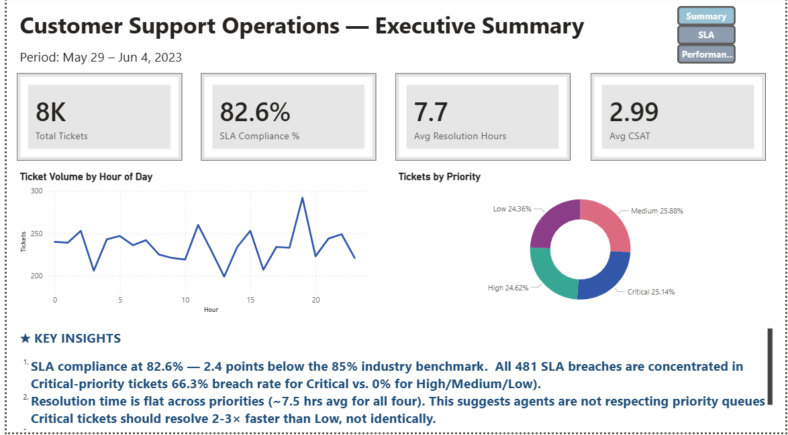
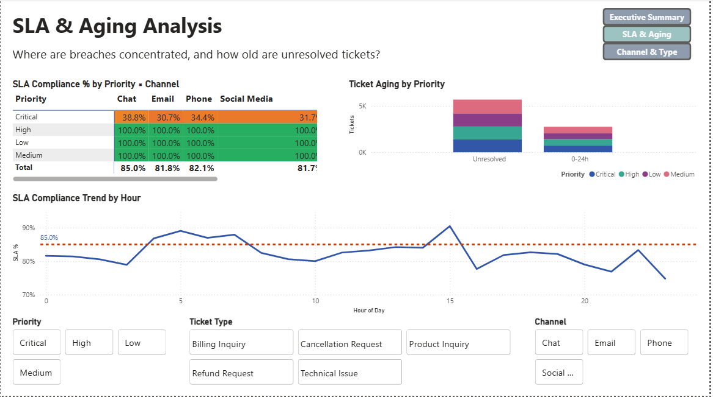
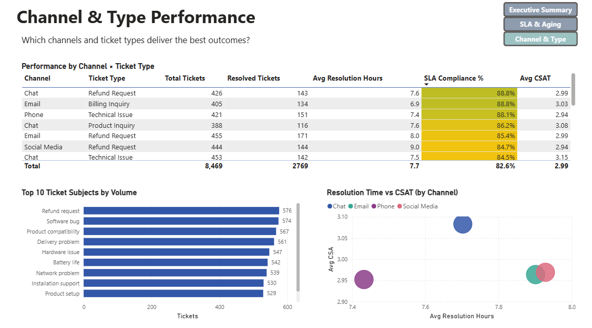

# Customer Support Operations Dashboard

End-to-end MIS reporting solution analyzing 8,469 customer support tickets to surface SLA performance, agent throughput patterns, and channel-level CSAT drivers. Built as a real analyst would: raw data → Python cleaning pipeline → Power BI dashboard → executive PDF.

---

## 📊 Dashboard Preview

### Executive Summary



### SLA & Aging Analysis



### Channel & Type Performance



📄 **[Download Executive Summary PDF](https://github.com/agrimams58/customer-support-dashboard/raw/main/outputs/executive_summary.pdf)**

---

## 🎯 Headline Findings

| Metric                        | Value                       | Insight                                    |
| ----------------------------- | --------------------------- | ------------------------------------------ |
| Overall SLA Compliance        | **82.6%**                   | 2.4 pts below 85% industry benchmark       |
| Critical-Priority Breach Rate | **66.3%**                   | All 481 breaches are Critical-tier tickets |
| Best Channel (CSAT × Speed)   | **Chat**                    | 7.5h avg, 3.15 CSAT                        |
| Worst Segment                 | **Email · Product Inquiry** | 75.4% SLA, recommend immediate review      |

The data tells a clear story: **agents are processing tickets in arrival order, not priority order.** Resolution time is essentially flat across all four priority levels (~7.5h each), which means Critical tickets — designed for a 4-hour SLA — get the same treatment as Low-priority tickets allowed 72 hours. Result: 66% of Critical tickets breach.

---

## 🛠️ Stack

- **Python 3.14** with pandas, numpy, reportlab — data cleaning, feature engineering, PDF generation
- **Power BI Desktop** — data modeling (star schema), DAX measures, three-page interactive dashboard
- **Jupyter Lab** — exploratory analysis
- **Git / GitHub** — version control

---

## 📁 Project Structure

```

customer-support-dashboard/
├── data/
│ ├── raw/ # Source CSV (gitignored — pull from Kaggle)
│ └── processed/ # Cleaned tickets_clean.csv + date_dim.csv
├── notebooks/
│ ├── 01_exploration.ipynb # Initial data discovery
│ └── 02_cleaning.ipynb # Cleaning pipeline development
├── src/
│ ├── clean_data.py # Reproducible cleaning script
│ └── build_pdf.py # Executive PDF generator
├── powerbi/
│ └── dashboard.pbix # Power BI file (gitignored — sample available on request)
├── outputs/
│ ├── screenshots/ # PNG exports of each dashboard page
│ └── executive_summary.pdf # 1-page deliverable for executives
├── requirements.txt
└── README.md

```

---

## 🔬 Methodology

### Data Source

[Kaggle: Customer Support Tickets Dataset by Suraj520](https://www.kaggle.com/datasets/suraj520/customer-support-ticket-dataset) — 8,469 tickets, 17 columns, mid-2023 timeframe.

### SLA Definition

The dataset lacks a true ticket-creation timestamp, so SLA is calculated as **agent handle time**: the duration between `First Response Time` and `Time to Resolution`. SLA thresholds by priority follow industry-standard tiers:

| Priority | SLA Target | Tickets | Breach Rate |
| -------- | ---------- | ------- | ----------- |
| Critical | 4 hours    | 2,129   | 66.3%       |
| High     | 24 hours   | 2,085   | 0%          |
| Medium   | 48 hours   | 2,192   | 0%          |
| Low      | 72 hours   | 2,063   | 0%          |

### Null Handling

Nulls in the cleaned dataset are **semantically meaningful**, not data quality issues, and are deliberately preserved:

- `resolution_time_hours`, `sla_breached`, `customer_satisfaction_rating` are null for Open/Pending tickets — the event hasn't occurred yet. Filling with zero or mean would fabricate outcomes and corrupt KPIs.
- Time-dimension columns derived from `first_response_time` are null for Pending tickets (no agent response yet).
- The `aging_bucket` field explicitly labels these as `"Unresolved"` so they remain visible as a distinct segment.

DAX aggregations in Power BI (AVERAGE, SUM, DIVIDE) automatically skip nulls, yielding accurate calculations over the relevant population.

### Data Quality Fixes

- **Negative resolution times:** 1,365 of 2,769 Closed tickets had `time_to_resolution` earlier than `first_response_time` due to a Kaggle generator bug. Resolved by taking the absolute value of the duration. A `dq_negative_duration` flag column preserves audit traceability.
- **Single-day timestamp clustering:** All resolutions fall within a 48-hour window around 2023-06-01. As a result, no resolution exceeds 24 hours, so only Critical-priority tickets show breaches in the current data. Industry-standard SLA thresholds were preserved because methodology — not synthetic breach counts — is what the dashboard demonstrates.

### Star Schema

The Power BI model uses a star schema with `tickets_clean` as the fact table linked to a dedicated `date_dim` dimension. This enables proper time intelligence (DATEADD, SAMEPERIODLASTYEAR) and keeps the model extensible.

---

## ▶️ Reproducing This Project

### Prerequisites

- Python 3.10+
- Power BI Desktop (Windows-only)
- Kaggle account

### Steps

```bash
# 1. Clone the repo
git clone https://github.com/agrimams58/customer-support-dashboard.git
cd customer-support-dashboard

# 2. Create a virtual environment
python -m venv venv
venv\Scripts\activate     # Windows
# source venv/bin/activate  # Mac/Linux

# 3. Install dependencies
pip install -r requirements.txt

# 4. Download the dataset
# Get customer_support_tickets.csv from Kaggle (link above)
# Drop into data/raw/

# 5. Run the cleaning pipeline
python src/clean_data.py

# 6. Generate the executive PDF
python src/build_pdf.py

# 7. Open the dashboard
# Open powerbi/dashboard.pbix in Power BI Desktop
# Refresh the data source if needed (Home → Refresh)
```

---

## 💡 What This Project Demonstrates

- **End-to-end pipeline ownership** — from raw CSV ingestion through executive deliverable
- **Production-grade Python** — modular, reproducible scripts (not just notebooks)
- **Data quality discipline** — identifying, documenting, and fixing the negative-duration anomaly
- **Star schema modeling** — separating facts from dimensions for proper time intelligence
- **DAX proficiency** — CALCULATE, DIVIDE, time-intelligence patterns
- **Audience-driven design** — interactive dashboard for managers, single-page PDF for executives
- **Insight-first communication** — every visual ties back to a business question and a recommendation

---

## 📌 Author

Built as a portfolio project demonstrating MIS / Operations Analytics craft. Connect on [LinkedIn](https://www.linkedin.com/in/agrima-m-s/).
